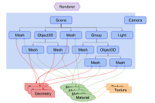

# Three.js_study
### Three.js : 웹페이지에 3D 객체를 쉽게 렌더링하도록 도와주는 자바스크립트 3D 라이브러리

WebGL로도 3D 객체를 만들 수 있는데, WebGL과 Three.js는 어떤 **차이점**이 있을까?
WebGL은 점, 선, 삼각형만을 그리는 단순한 시스템이다.
그래서 WebGL로 무언가를 만드려면 굉장히 많은 양의 코드를 작성해야 한다.
Three.js는 WebGL을 사용하여 3D 요소의 처리를 돕기 때문에 보다 간단하게 코드를 짤 수 있다.
쉽게 말해서 WebGL - Three.js는 Vanilla JS - React의 관계와 유사한 것!
**Vanilla JS로 작성한다면 방대해질 코드를 React를 사용한다면 훨씬 짧고 간단하게 작성할 수 있는 것처럼, Three.js를 사용하면 개발자가 같은 기능도 더 간단히 구현할 수 있다.**
[구조]

- Renderer

Three.js의 핵심 객체이다.
Scene과 Camera 객체를 넘겨받아 카메라의 Frustrum 안 3D Scene의 일부를 평면 이미지로 렌더링한다.
Three.js에서 Frustrum은 카메라 시야 안에 들어갈 내용물을 결정하는 데 쓰인다. 쉽게 말하면 카메라 렌즈를 통해 보이는 특정 공간을 의미한다.

- Scene Graph

Scene 혹은 다수의 Mesh, Light, Group, Object3D, Camera로 이루어진 트리 구조와 유사하다.
Scene은 Scene Graph의 최상위 노드이다. background color, fog 등의 요소를 포함한다.
Scene에 포함된 객체들도 부모 / 자식의 트리 구조로 이루어져있다.
여기서 자식 객체의 위치와 방향은 부모 기준이다.

- Mesh

Material로 하나의 Geometry를 그리는 객체이다.
쉽게 이야기하면 하나의 덩어리이다.
여러 개의 Mesh가 하나의 Material 혹은 Geometry를 동시에 참조할 수 있다.

- Geometry

Gemoetry 객체의 정점 (vertex, 꼭짓점) 데이터이다.
구, 정육면체, 면, 개, 고양이 등 다양한 모양이 될 수 있다.

- Material

Geometry 객체를 그리는 데 사용하는 표면 (Texture) 속성이다.
색, 밝기, 텍스처, 반질거림, 투명도 등을 설정할 수 있다.
하나의 Material은 여러 개의 Texture를 사용할 수 있다.

- 출처
  - https://velog.io/@greencloud/Three.js%EC%99%80%EC%9D%98-%EC%84%A4%EB%A0%88%EB%8A%94-%EC%B2%AB%EB%A7%8C%EB%82%A8-
  - https://velog.io/@seongmini/Three.js-3D-%EA%B7%B8%EB%9E%98%ED%94%BD-%EC%9E%85%EB%AC%B8%ED%95%B4%EB%B3%B4%EA%B8%B0
  - https://ungumungum.tistory.com/106
  - https://velog.io/@jeon-yj/React.js-%EC%97%90%EC%84%9C-THREE.JS-%EC%82%AC%EC%9A%A9%ED%95%98%EA%B8%B0
